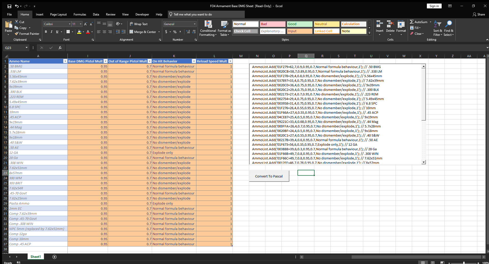

# Brians FO4Edit / Excel Ammo Type Weapon Damage Patcher
Patches balistic weapons based on ammo type. Requires Excel & FO4Edit

#### Update
Bash no longer required to convert the spreadsheet as long as you have Excel or an editor capable of using macro embedded spreadsheets. Use the xlsm spreadsheet and click the button on the right side.
You will see the text appear in the window above. Click into this text box then press `Ctrl+A` and then `Ctrl+C` to select all text and copy to the clipboard. From here paste the text into the FO4Edit script as described in the tutorial video

#### Video Tutorial
[](https://www.youtube.com/watch?v=cYfwkQnWfY4)

#### Spreadsheet Screenshots
[](screenshots/1.png)
[](screenshots/0.png)

#### Dependencies
```
Excel w/ VBA Macro Support

FO4Edit:
 * MXPF
 
BASH (Only if you want to use the xlsx):
 * bc
 * xlsx2csv
```

#### Installation

FO4Edit Script
```
Copy 'FO4 - Brians Weapon Patcher.pas' to 'Fo4Edit/Edit Scripts'
Install MXPF to 'Fo4Edit/Edit Scripts/lib'
```

Bash Script (Only if you want to use the XLSX sheet)
```sh
# Download the SH file to Linux or to WSL
chmod +x ./weapons.sh
sudo apt install bc
sudo pip install xlsx2csv
```

#### Usage
Everyone w/ Windows & Excel:
* Run Excel and disable protected mode
* Edit values and click the button on the right
* Replace the section in the Fo4Edit script same as described in video
* Run Fo4Edit script & save
* Make sure plugin loads last

Linux:
```sh
./weapons.sh <path_to_xlsx>
# Output will go to './test.txt' and to stdout
# Copy the output into the FO4 edit script where you see the same values (overwrite them)
# Apply script to records you want in FO4Edit and save
```

#### License
```
MIT License

Copyright (c) 2022 Brian Wilson

Permission is hereby granted, free of charge, to any person obtaining a copy
of this software and associated documentation files (the "Software"), to deal
in the Software without restriction, including without limitation the rights
to use, copy, modify, merge, publish, distribute, sublicense, and/or sell
copies of the Software, and to permit persons to whom the Software is
furnished to do so, subject to the following conditions:

The above copyright notice and this permission notice shall be included in all
copies or substantial portions of the Software.

THE SOFTWARE IS PROVIDED "AS IS", WITHOUT WARRANTY OF ANY KIND, EXPRESS OR
IMPLIED, INCLUDING BUT NOT LIMITED TO THE WARRANTIES OF MERCHANTABILITY,
FITNESS FOR A PARTICULAR PURPOSE AND NONINFRINGEMENT. IN NO EVENT SHALL THE
AUTHORS OR COPYRIGHT HOLDERS BE LIABLE FOR ANY CLAIM, DAMAGES OR OTHER
LIABILITY, WHETHER IN AN ACTION OF CONTRACT, TORT OR OTHERWISE, ARISING FROM,
OUT OF OR IN CONNECTION WITH THE SOFTWARE OR THE USE OR OTHER DEALINGS IN THE
SOFTWARE.
```
